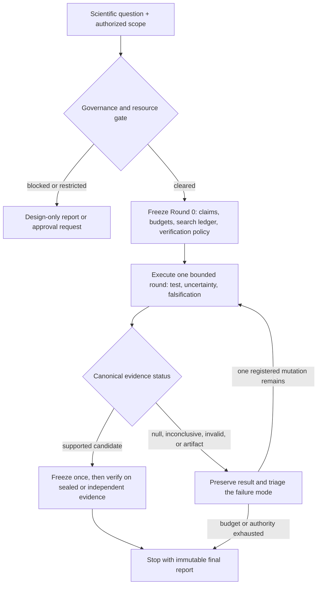

# Scientific Autoresearch



`scientific-autoresearch` is a vendor-neutral [Agent Skill](https://agentskills.io) for bounded, mechanism-first scientific investigation. It helps an agent turn an open-ended question into testable claims, execute finite evidence rounds, learn from null results without result shopping, and preserve reproducible decisions.

Current version: **0.2.0**.

## Scope

Use the skill for research that requires several of these capabilities:

- generate and maintain a finite portfolio of candidate mechanisms;
- translate mechanisms into claim cards, observables, estimands, and falsifiers;
- audit whether available data can support a claim;
- separate exploration, confirmation, internal validation, sealed-holdout verification, and replication;
- control adaptive search, multiplicity, stochastic variation, compute, and stopping;
- distinguish a failed formulation from a failed mechanism;
- produce immutable round-by-round evidence and decisions.

Do not use it for literature-only review, manuscript editing, routine execution of a fixed pipeline, or unauthorized live human, animal, clinical, field, wet-lab, hazardous, or external-system actions.

## Version 0.2.0 Highlights

- Three execution modes: `design_only`, `single_round`, and finite `multi_round`.
- A mandatory scope, authorization, privacy, safety, and resource gate.
- Conservative default budgets when autonomous work is requested without limits.
- A search and inference ledger for adaptive testing and multiplicity.
- Sealed verification evidence and explicit compromised-holdout handling.
- Multi-seed and numerical-variation rules for machine learning and simulation.
- Separate canonical fields for governance, mechanism, formulation, evidence role, verification, and next action.
- `null` versus `inconclusive` based on support and sensitivity, not only a threshold test.
- Immutable `runs/<run_id>/rounds/round_NNN/` outputs with privacy and secret-redaction rules.
- Conditional adapters for observational data, machine learning and simulation, and causal or experimental work.
- Output-quality evals and trigger eval queries following the Agent Skills evaluation pattern.

## Core Loop

```text
question -> mechanism -> claim -> test -> falsification -> interpretation -> decision
```

Every autonomous run begins by freezing a finite charter: allowed inputs and actions, governance status, claim cards, candidate and round budgets, data-look and mutation budgets, resource limits, verification policy, and stopping boundaries.

## Repository Layout

```text
.
├── README.md
├── CHANGELOG.md
├── CITATION.cff
├── CITATION.bib
├── LICENSE
├── scripts/
│   └── validate_skill.py
└── scientific-autoresearch/
    ├── SKILL.md
    ├── evals/
    │   ├── evals.json
    │   └── eval_queries.json
    └── references/
        ├── causal-experimental.md
        ├── claim-types.md
        ├── falsification-toolkit.md
        ├── governance-safety.md
        ├── literature-evidence.md
        ├── ml-simulation.md
        ├── null-triage.md
        ├── observational-data.md
        ├── report-contract.md
        ├── round-gate-checklist.md
        ├── scientific-review-lens.md
        ├── statistical-discipline.md
        ├── status-schema.md
        └── thinking-principles.md
```

Only the `scientific-autoresearch/` directory is the installable skill. Repository-level scripts, citation files, and documentation support distribution and maintenance.

## Installation

Copy or link the installable directory into a skills directory recognized by your agent client:

```bash
git clone https://github.com/JialeWW/scientific-autoresearch.git
cp -R scientific-autoresearch/scientific-autoresearch /path/to/your/skills-directory/
```

The installed path must end with:

```text
scientific-autoresearch/SKILL.md
```

Discovery and configuration vary by client. The skill itself contains no client-specific metadata or tool dependency.

## Basic Usage

### Design only

```text
Use the scientific-autoresearch skill to turn this mechanism into a claim card,
minimal test, uncertainty plan, and falsifier. Do not execute an analysis.
```

### One executed round

```text
Use the scientific-autoresearch skill to run one bounded analysis round over
the approved local data. Preserve immutable outputs and stop after reporting.
```

### Bounded autonomous run

```text
Use the scientific-autoresearch skill to investigate this question for at most
three rounds and four active candidates. Do not acquire new data or submit
external compute. Freeze the verification policy before looking at outcomes.
```

## Executed-Run Outputs

The default immutable layout is:

```text
runs/<run_id>/
  run_manifest.json
  candidate_registry.csv
  rounds/round_000/
    report.md
    inventory.json
    summary.csv
    diagnostics.<csv|parquet|jsonl>   # conditional
    figures/                          # conditional
    reproduce_commands.txt
    round_gate.md
  final_report.md
```

Sensitive diagnostics must be minimized or de-identified. Reproduction records must redact credentials, tokens, signed links, private identifiers, and restricted paths.

## Validation

Run the repository validator:

```bash
python scripts/validate_skill.py scientific-autoresearch
```

The validator checks required frontmatter, naming, description length, reference routing, JSON eval files, line limits, and release-version consistency. A compatible implementation of the Agent Skills reference validator can provide an additional specification check:

```bash
skills-ref validate scientific-autoresearch
```

## Evaluation

`scientific-autoresearch/evals/evals.json` contains behavioral cases for:

- design-only mode;
- observational support and geometry;
- sealed-test machine-learning work;
- costly simulation and approval boundaries;
- sensitive human data and result-shopping pressure;
- null triage and bounded mutations;
- causal identification limits.

`scientific-autoresearch/evals/eval_queries.json` contains balanced should-trigger and should-not-trigger prompts for testing the frontmatter description. Run evals in isolated contexts and compare v0.2.0 with the previous version or a no-skill baseline.

## Scientific Interpretation Standard

Promote a result only when it has a clear claim and estimand, mechanism-matched evidence, adequate support and sensitivity, meaningful effect scale, decomposed uncertainty, transparent search history, a falsifier that could have hurt it, and correctly labeled verification evidence.

Exploratory results remain valuable, but they remain exploratory until prospectively verified.

## Inspiration

This project was inspired by Andrej Karpathy's [`autoresearch`](https://github.com/karpathy/autoresearch) project and adapts iterative agent-run experimentation to general scientific inference, with additional emphasis on governance, bounded autonomy, support audits, falsification, adaptive-search control, and reproducibility.

## Citation

Use the metadata in [`CITATION.cff`](CITATION.cff) or [`CITATION.bib`](CITATION.bib). For manuscripts, cite the tagged release.

## License

MIT License. See `LICENSE`.
