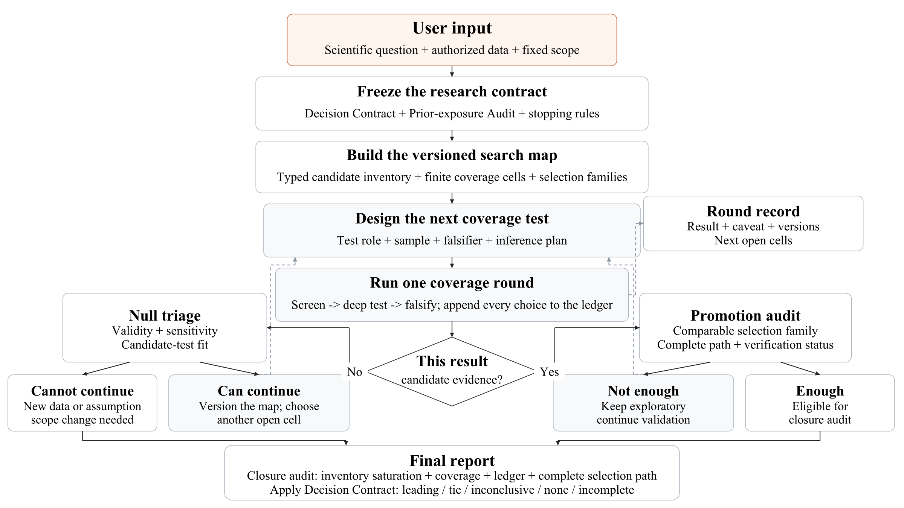

# Scientific Autoresearch



[Vector PDF](figures/scientific-autoresearch-workflow.pdf) · [Vector SVG](figures/scientific-autoresearch-workflow.svg)

The publication figure shows the explicit systematic-coverage branch, including its yes/no continuation paths. Frozen and bounded outcome-adaptive programs use the same test–audit–decision loop but do not build a search map or closure audit unless systematic coverage is requested.

`scientific-autoresearch` is a client-neutral [Agent Skill](https://agentskills.io) for iterative, falsifiable, and auditable scientific work. It can run a fully frozen analysis program, conduct outcome-adaptive research, or systematically cover a finite data-supported candidate space. Scientific controls scale with outcome-driven scientific discretion; ordinary engineering iteration stays outside the scientific selection history.

Current version: **0.3.1**.

The release source of truth is `metadata.version` in `scientific-autoresearch/SKILL.md`. Historical machine-audit schemas and benchmark protocols have independent, immutable version lines.

## Version 0.3.1 Highlights

Version 0.3.1 keeps the active research behavior restored in v0.3.0 while physically removing the legacy machine-audit system from the default Skill:

```text
question -> mechanism or substantive candidate
         -> supported observable or prediction -> test
         -> scientific interpretation -> next candidate or refinement
         -> final audit
```

The default behavior is to build a compact candidate board, test the most informative supported candidate, learn from the result, and continue autonomously. A weak result redirects the search; it does not end the task while another distinct supported test remains. A round is a scientific interpretation checkpoint, not a tool call, retry, worker change, or mandatory user-confirmation point.

When systematic coverage is explicitly requested, v0.3.1 retains full finite-scope completion: a versioned data-supported inventory, candidate-forward and data-product-reverse saturation audits, finite coverage cells, complete selection-path inference, and an exact open queue. It removes coverage as the default for ordinary multi-round work; it does not remove the capability.

Freeze the smallest coherent current batch rather than an imagined entire future project. Ordinary multi-round work uses one compact candidate board and result–decision record. Formal scoped completion adds a compact scientific coverage record, not an immutable artifact tree.

The redesign keeps later scientific safeguards that materially improve validity:

- a compact data-to-decision plan that defines the actual decision, comparable candidates, ranking evidence, ties, and inconclusive outcomes;
- prior-exposure tracking that follows overlapping outcome information across code, sample, split, repository, workflow, or skill changes;
- independent statistical units, group-aware partitions and resampling, support and data-integrity checks;
- scale and parameter sensitivity, including radius, aperture, binning, threshold, and resolution when relevant;
- measurement-error propagation, systematics, negative controls, falsification, and transportability;
- explicit mapping between screening statistics and final predictive or inferential models;
- inference that accounts for frozen winner selection or the complete outcome-adaptive selection path;
- preservation of weak, null, failed, conflicting, and unfavorable branches;
- finite data-supported coverage, saturation audits, and open queues only when systematic coverage is actually requested.

It removes the default coupling between ordinary development and immutable scientific audit. Worker, chunk, cache, scheduler, equivalent implementation, resource smoke, and response-blind qualification changes no longer rebuild scientific contracts, hashes, ledgers, and prior valid computations.

The official runtime archive now contains only `SKILL.md`, scientific references, and the license. The schema-1.5.4 validator and its report-contract, status-schema, and round-gate references remain recoverable from the immutable v0.3.0 release but are not installed with v0.3.1. This reduces the behavior-bearing runtime surface by about 83% and removes the strongest accidental path into manifest, receipt, snapshot, and repeated-hash work.

## Default Scientific Behavior

The always-loaded core is science-forward:

- Build mechanisms first for mechanism questions and substantively distinct models, relations, features, simulations, designs, interventions, or failure modes for other questions.
- Run the simplest supported test that best distinguishes the leading alternatives, interpret it scientifically, and autonomously choose the next candidate, falsifier, validation, or refinement.
- After weak or null evidence, check support, sensitivity, observable choice, scale, measurement error, model fit, and systematics before moving through the remaining candidate board.
- Record each outcome-informed scientific modification before running it, preserve the earlier branch, and include every selection-influencing attempt in final inference.
- Before ending ordinary research, perform one lightweight candidate-forward and data-product-reverse omission review. Reserve saturation and coverage-completion claims for explicitly requested full coverage.

Execution continues inside the authorization and frozen rules without renewed confirmation at every checkpoint.

If the request is only prospective design, do not generate outcomes. If it is only a read-only audit, do not execute, repair, or extend the work without authorization.

## Compact Records and Engineering Boundaries

Use one persistent compact record by default: the candidate board, frozen batches, data and code versions, decision-bearing outcomes and choices, failures, and report. Add a contemporaneous decision entry when outcomes alter the scientific path. Do not create a formal inventory, coverage matrix, bundle, or artifact tree for ordinary work.

Record input identity once at first production use and verify it again before final reporting or handoff. Prefer a stable version or snapshot identifier; use a digest only when no adequate identifier exists or exact byte identity matters. Do not hash unchanged inputs, code, or intermediate outputs at every batch.

Use master random seed `42` by default unless the user or an established project has already fixed another seed. Comparable candidates and exact reruns reuse the same seed or stream rule. When stochastic robustness needs multiple realizations, derive and freeze their set from master `42`, retain them all, and aggregate without seed selection.

Classify changes by their scientific effect rather than by a named contract type. Equivalent worker, chunk, scheduler, cache, implementation, retry, and path changes do not reopen science. Data or code changes that can alter support, eligibility, sample, estimand, ranking, or interpretation require affected checks and, when outcome-informed, enter the selection path.

Do not invent qualification work without a concrete failure mode. For material data, numerical, memory, I/O, or runtime risk, qualify the affected execution response-blindly; once the relevant criteria pass, begin science. Independent families do not block one another, while shared dependencies and joint decisions gate only their dependents.

Ordinary research assumes accidental error and ordinary infrastructure failure. It does not create manifest trees, checksum indexes, receipts, immutable round snapshots, status-transition files, or run validators.

Detailed result-blinding, evidence-independence, implementation-independence, and execution-lifecycle rules live in routed scientific references. The core retains the essential boundary: same-data reruns are reproduction or internal validation, not independent verification.

## Continuous Scientific Decisions

At each scientific checkpoint, the current frozen plan determines the branch:

- A credible candidate passes through effect-size, uncertainty, systematics, selection-correction, comparability, and verification review. If evidence is not yet sufficient for its declared stage, the next validation or falsification batch is frozen and execution continues.
- A weak or null result is triaged for mechanism weakness, wrong observable or scale, inadequate sensitivity, unsupported sample, model failure, or systematic error. A discriminating successor is frozen when available; otherwise the result is reported as null, inconclusive, support-limited, or needing new data.

A bounded result describes the current claim strength; it is not permission to stop while another material supported test remains. When full systematic coverage or scoped completion is explicitly requested, execution advances toward closure until completion or a real authorization, resource, governance, or scientific boundary. A user-requested bounded coverage stage ends at its declared stage boundary with the exact open queue.

## Repository Layout

```text
.
├── README.md
├── CHANGELOG.md
├── CITATION.cff
├── CITATION.bib
├── figures/
├── scripts/
│   ├── build_installable_skill.py
│   └── validate_skill.py
├── compatibility/
│   └── README.md
├── benchmarks/
│   ├── README.md
│   ├── development-cases/
│   │   ├── v0.3.0-routing-efficiency.json
│   │   └── v0.3.1-lightweight-runtime.json
│   ├── development-runs/
│   ├── protocol-index.json
│   ├── score-v2.1.2.py
│   ├── tests/
│   └── results/
└── scientific-autoresearch/
    ├── SKILL.md
    ├── evals/
    └── references/
```

The runtime installable surface is only `scientific-autoresearch/SKILL.md` and `scientific-autoresearch/references/`. The source-tree `scientific-autoresearch/evals/` directory is retained only for the immutable v0.2.8 benchmark line and is excluded from the official v0.3.1 skill archive. Repository-level benchmark, compatibility, and maintenance materials are not default Agent context.

## Installation

Prefer the versioned release asset `scientific-autoresearch-v0.3.1-skill.zip`; it contains one installable `scientific-autoresearch/` directory and excludes historical benchmark evals, validators, scripts, and formal machine-audit references. Extract that directory into a skills directory recognized by the Agent client.

For a source checkout, copy only the runtime surface:

```bash
git clone https://github.com/JialeWW/scientific-autoresearch.git
mkdir -p /path/to/your/skills-directory/scientific-autoresearch
cp scientific-autoresearch/scientific-autoresearch/SKILL.md /path/to/your/skills-directory/scientific-autoresearch/
cp -R scientific-autoresearch/scientific-autoresearch/references /path/to/your/skills-directory/scientific-autoresearch/
```

The installed path must contain `scientific-autoresearch/SKILL.md`. The package is client-neutral and contains no client-specific metadata.

## Example Requests

### Frozen continuous program

```text
Use scientific-autoresearch to execute this fully prespecified candidate family.
Freeze its held-out comparison, joint inference, falsifiers, stopping and reporting
rules before outcomes, then run continuously to a bounded scientific result.
```

### Bounded adaptive research

```text
Use scientific-autoresearch to investigate these candidates autonomously. Keep one
compact candidate board and result-decision record, run the applicable scale and
systematics checks, learn from weak results, and continue while a material supported
candidate or falsifier could change the conclusion, or until a real boundary is reached.
```

### Explicit coverage search

```text
Use scientific-autoresearch to systematically cover the finite candidate and test
space supported by these data. Preserve every unrun cell in the open queue and do
not claim scoped completion unless the saturation and closure conditions pass.
```

## Legacy Machine-Audit Compatibility

The schema-1.5.4 machine-audit workflow is preserved in the immutable [v0.3.0 tag](https://github.com/JialeWW/scientific-autoresearch/tree/v0.3.0) for existing structured runs. It is deliberately absent from the v0.3.1 Skill archive. Use the frozen v0.3.0 package only when an existing run actually depends on that schema; do not mix its provenance or artifact rules into ordinary v0.3.1 research.

## Evaluation Status

The latest frozen benchmark protocol/scorer remains **2.1.2**, with Skill **0.2.8** as its immutable release under test. Those protocol artifacts and historical `not_evaluated` results are not rewritten for v0.3.1.

`benchmarks/development-cases/v0.3.0-routing-efficiency.json` remains the historical unscored routing specification. `benchmarks/development-cases/v0.3.1-lightweight-runtime.json` adds unscored regression cases for one-time input identity, zero intermediate rehashing, no formal artifact tree in ordinary multi-round work, active continuation through weak results, scientifically justified support thresholds, reproducible master seed 42 without seed selection, and explicit finite coverage. These specifications are not benchmark measurements. Skill 0.3.1 remains **not evaluated** until a frozen successor suite is executed.

Two unfrozen qualitative development probes are preserved under `benchmarks/development-runs/`. One specified compact-record continuation after a weak result; the other retained full scoped-coverage planning and an exact open queue without requiring a machine-audited schema. Because no model, runtime, sampling, timing, or judge protocol was frozen and no scientific computation was executed, these are diagnostics only and do not change the **not evaluated** status or establish superiority over v0.2.1.

The existing source-tree `scientific-autoresearch/evals/*.json` files remain byte-frozen at their historical paths because protocol 2.1.2 binds those paths and hashes for Skill 0.2.8. They are legacy benchmark inputs, not v0.3.1 runtime instructions or current examples, and are excluded from the official v0.3.1 installable archive and runtime-package digest. Moving them requires a future benchmark protocol that preserves the old line rather than silently breaking it.

## Scientific Interpretation

Only substantively eligible candidates with compatible targets, support, estimands, evidence bases, and data-quality regimes may be directly ranked. Inference must cover the full selection procedure. Weak and failed results remain in the record, and seeds, scales, checkpoints, or subgroups may not be selected because they improve the outcome.

For completed coverage work, scope the statement to the actual data-supported inventory. Do not claim exhaustion of all scientific possibilities.

## Inspiration

This project was inspired by Andrej Karpathy's [`autoresearch`](https://github.com/karpathy/autoresearch) and adapts iterative Agent-run experimentation to general scientific inference with falsification, adaptive-selection control, and reproducibility.

## Citation and License

Use [`CITATION.cff`](CITATION.cff) or [`CITATION.bib`](CITATION.bib) for a tagged release. Distributed under the MIT License; see `LICENSE`.
