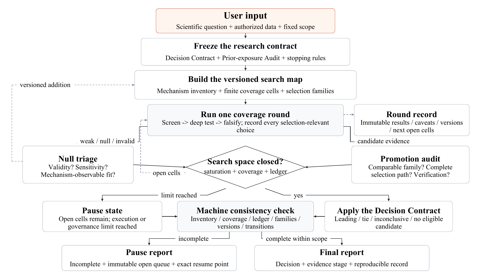

# Scientific Autoresearch



[Vector PDF](figures/scientific-autoresearch-workflow-v0.2.1.pdf) · [Vector SVG](figures/scientific-autoresearch-workflow-v0.2.1.svg)

`scientific-autoresearch` is an agent-independent [Agent Skill](https://agentskills.io) for auditable scientific investigation. It scales from prospective design and read-only audit through frozen analyses, adaptive candidate search, and coverage-based search over a finite, data-supported space. It matches procedural overhead to outcome adaptivity while preserving conservative inference.

Current version: **0.2.5**.

## Scope

Use the skill when the user requests scientific audit or provenance, when outcome-informed choices generate, modify, filter, rank, or promote scientific candidates, or when systematic data-supported coverage is requested. Depending on profile, it can:

- inspect completed work read-only without initiating new analysis;
- execute one frozen claim through one prespecified analysis or a finite prespecified analysis family;
- build a typed inventory of mechanisms, models, features, simulation formulations, or design alternatives supported by the available data;
- translate each eligible candidate into finite observables, formulations, parameters, supported samples, estimands, and falsifiers;
- define comparable selection families and retain incomparable or support-limited candidates as parallel conclusions;
- freeze a Decision Contract covering the final decision, admissible evidence, ranking rule, tie rule, and inconclusive rule;
- audit prior exposure to the same or overlapping data, including earlier analyses, parameter trials, and result views;
- separate exploratory analysis, internal validation, independent verification, and replication;
- cover the complete candidate-generation, modification, filtering, and promotion path with an appropriate inferential design;
- claim scoped scientific completion only after the full closure gate passes; otherwise issue a bounded report or pause with an open queue;
- produce versioned evidence, auditable state transitions, and reproducible decisions.

Select the profile according to the requested action and outcome adaptivity. Use `design_only` for prospective design, `audit_only` for read-only inspection of completed work, `fixed_test` for a frozen single analysis or finite frozen family, `adaptive_search` when outcomes can change candidate selection, and `coverage_search` for systematic coverage of a versioned data-supported space. Scope and authorization gates govern sensitive, regulated, costly, prospective, physical, or external-system actions.

## Version 0.2.5 Highlights

- Adds non-executing `audit_only` for retrospective inspection without forced run machinery.
- Extends `fixed_test` to finite prespecified analysis families, including frozen multiplicity and joint decision rules, without adaptive-search overhead.
- Separates default `conceptual_record` from explicitly requested `machine_audited` artifacts.
- Bounds prior-exposure audits, reduces duplicate statistical guidance, batches inventory additions, and preserves unaffected coverage closure.
- Keeps complete-selection-path inference for genuinely outcome-adaptive work and full closure gates for coverage claims.

## Choose the Smallest Valid Profile

- `design_only`: prospectively construct a question, claim card, inventory, or analysis design without inspecting completed outcomes or executing analysis.
- `audit_only`: inspect completed results and provenance read-only; recommend future work without running it.
- `fixed_test`: one frozen claim and sample, using one prespecified analysis or a finite frozen family under one joint decision rule, with no outcome-dependent change.
- `adaptive_search`: outcomes may change candidates, formulations, screens, retention, ranking, or promotion. Require a Decision Contract, bounded prior-exposure audit, ledger, selection families, and inference covering the actual adaptive path.
- `coverage_search`: systematically search a versioned finite data-supported space and assess scoped completion. Add typed inventory coverage, complementary saturation audits, the open queue, and coverage-completion rules.

The number of tests alone does not determine the profile. A fully frozen comparison remains `fixed_test`; an inspected outcome that spawns a new threshold, model, subgroup, or formulation requires `adaptive_search`. A search becomes `coverage_search` only when it attempts systematic scoped coverage or makes a scientific-completion claim.

Record mode is separate. `conceptual_record` is the default and keeps the required content in the working report or existing project records. `machine_audited` creates the structured run directory only when requested, when resuming an existing structured run, when a formal machine handoff requires it, or before `coverage_search` claims `complete_within_scope`.

Conditional gates remain strict when applicable. Require transport analysis only when evidence is carried across materially different target or reporting populations; measurement-error sensitivity only when uncertainty can affect support, eligibility, selection, ranking, or the conclusion; and a screening-to-decision mapping only when a selection-influencing screen and the final evidence use different statistics, estimands, or scales.

## Coverage-Search Loop

```text
decision -> prior exposure -> inventory -> coverage cells -> tests -> ledger
         -> selection-path inference -> saturation audit -> decision or open queue
```

The search space is bounded by the available data products and explicit formulations, not by a universal number of candidates or rounds. Rounds are write-once-by-policy execution checkpoints. The validator reconciles their recorded hashes; tamper evidence against coordinated rewriting of both files and manifest requires an append-only or externally anchored store. A run may use inexpensive uniform screening before deeper tests, but scheduling priority never counts as scientific coverage.

The workflow figure at the top depicts `coverage_search`, the most expansive profile. `design_only` and `audit_only` do not enter its execution loop; a `fixed_test` follows its compact frozen-analysis profile, while an `adaptive_search` activates the steps required by its actual selection risk.

A `stage_report` may validly close the work authorized for the current checkpoint: it states what ran, what was learned, which safeguards applied, and what remains open, while leaving candidate-space saturation and coverage unresolved. A `fixed_test` can finish when its frozen single analysis or family and joint rule are complete; an `adaptive_search` can report its current decision state while leaving exhaustive coverage open. Scientific completion (`complete_within_scope`) is reserved for `coverage_search` and requires a machine-audited record, inventory saturation, closure of every eligible coverage cell, an audited complete selection ledger, application of the frozen Decision Contract with a terminal decision, an adequate prior-exposure audit for the claim, and a passing consistency check.

Inventory saturation requires both a candidate-forward audit and a data-product-reverse audit to produce no unresolved additions. A third independent audit source—such as literature, theory, expert knowledge, or known failure modes—is added when the scientific question makes it informative. Literature review is therefore conditional, not mandatory for every run.

## Repository Layout

```text
.
├── README.md
├── CHANGELOG.md
├── CITATION.cff
├── CITATION.bib
├── LICENSE
├── figures/
│   ├── scientific-autoresearch-workflow-v0.2.1.pdf
│   ├── scientific-autoresearch-workflow-v0.2.1.png
│   └── scientific-autoresearch-workflow-v0.2.1.svg
├── scripts/
│   └── validate_skill.py
└── scientific-autoresearch/
    ├── SKILL.md
    ├── scripts/
    │   └── validate_run.py
    ├── evals/
    │   ├── evals.json
    │   └── eval_queries.json
    └── references/
        ├── coverage-search.md
        ├── decision-selection.md
        ├── governance-safety.md
        ├── report-contract.md
        ├── statistical-discipline.md
        ├── status-schema.md
        └── ...
```

Only the `scientific-autoresearch/` directory is the installable skill. Repository-level scripts, citation files, and documentation support distribution and maintenance.

## Installation

Copy or link the installable directory into a skills directory recognized by your agent client:

```bash
git clone https://github.com/JialeWW/scientific-autoresearch.git
cp -R scientific-autoresearch/scientific-autoresearch /path/to/your/skills-directory/
```

The installed path must end with:

```text
scientific-autoresearch/SKILL.md
```

Discovery and configuration vary by client. The skill contains no client-specific metadata. Its run validator uses Python 3.10 or later and only the standard library.

## Basic Usage

### Design only

```text
Use the scientific-autoresearch skill to define the Decision Contract,
typed candidate inventory, or falsification plan needed for this question.
Do not execute an analysis or create a run directory.
```

### Read-only audit

```text
Use the scientific-autoresearch skill with audit_only to inspect these completed
results and provenance. Do not run a new analysis or modify candidate selection.
Return a compact audit report.
```

### One frozen analysis or finite family

```text
Use the scientific-autoresearch skill with the fixed_test profile to execute this
frozen claim using the supplied analysis family and joint decision rule. Keep the
record conceptual; do not generate or rank outcome-motivated alternatives.
```

### Adaptive candidate search

```text
Use the scientific-autoresearch skill with the adaptive_search profile to compare
these candidate models. Record every selection-influencing test and apply the
predeclared Decision Contract; do not claim coverage saturation.
```

### Coverage-based autonomous run

```text
Use the scientific-autoresearch skill with the coverage_search profile to search
the candidate types, observables, and tests supported by the approved data
products. Stop scientifically only when coverage is complete and the inventory
is saturated, the complete selection ledger is audited, the frozen Decision
Contract yields a terminal decision, prior exposure is adequate for that claim,
and the consistency check passes. If the authorized compute envelope ends first,
pause and save every unrun coverage cell in the open queue.
```

## Machine-Audited Run Outputs

Structured artifacts are created only in `machine_audited` mode and remain profile-proportionate. `fixed_test` records the frozen claim or finite family, versions, joint rule, results, uncertainty, falsifier, reproduction information, and consistency status. `adaptive_search` adds the bounded prior-exposure audit, selection families, candidate registry, and complete selection ledger. `coverage_search` uses the full structure below:

```text
runs/<run_id>/
  run_manifest.json
  decision_contract.json
  prior_exposure_audit.json
  data_versions.json
  inventories/candidate_inventory_vNNN.csv
  inventories/coverage_matrix_vNNN.csv
  inventories/saturation_audit_vNNN.json
  execution_queue.csv
  search_ledger.jsonl
  selection_families.json
  status_transitions.jsonl
  candidate_registry.csv
  rounds/round_NNN/
    report.md
    summary.csv
    reproduce_commands.txt
    round_gate.md
  consistency_report.json
  pause_report.md                 # when work remains open
  final_report.md                 # only after completion checks pass
```

Sensitive diagnostics must be minimized or de-identified. Reproduction records must redact credentials, tokens, signed links, private identifiers, and restricted paths.

## Validation

For explicitly requested `machine_audited` work, initialize the canonical metadata skeleton for a new run:

```bash
python scientific-autoresearch/scripts/validate_run.py --init runs/<run_id> \
  --profile <fixed_test|adaptive_search|coverage_search>
```

Initialization never overwrites an existing run or supplies scientific decisions or approvals; the skeleton remains invalid until its required fields and records are completed.

Before upgrading an existing machine-audited run, validate the source profile and create a non-overwriting, hash-bound history snapshot:

```bash
python scientific-autoresearch/scripts/validate_run.py \
  --snapshot-upgrade runs/<run_id> --to-profile <adaptive_search|coverage_search>
```

Review the copied evidence and append the exact `profile_history` entry returned by the helper while adding the new profile's artifacts. The helper does not edit the manifest or perform the scientific migration for you.

Run the repository validator:

```bash
python scripts/validate_skill.py scientific-autoresearch
```

Validate a run before resuming it and before issuing a pause or final report:

```bash
python scientific-autoresearch/scripts/validate_run.py runs/<run_id> \
  --output runs/<run_id>/consistency_report.json
```

For profile-aware runs, the validator reads the recorded profile and checks only the structures required by that risk level. It checks frozen single analyses or finite families and provenance for `fixed_test`, adds selection-path integrity for `adaptive_search`, and adds inventory, coverage, saturation, and queue consistency for `coverage_search`. Legacy runs retain their recorded schema behavior. A failed applicable check blocks the corresponding completion claim. Report that separately from numerical rerun agreement: matched inputs, code, environment, seeds, tolerances, and output hashes can support same-condition agreement for the checked outputs without repairing missing metadata. Hash reconciliation provides internal consistency, not proof against coordinated rewriting of every local record; externally anchor the digest when adversarial tamper evidence is required.

## Evaluation

The behavioral evals cover `design_only`, `audit_only`, and all three execution profiles across observational, machine-learning, simulation, sensitive-data, null-triage, and causal settings. They verify that a frozen finite comparison remains `fixed_test`, while only outcome-informed candidate changes activate adaptive-path machinery.

Trigger evals balance in-scope prompts with adjacent-task controls. Run evals in isolated contexts and compare v0.2.5 with the previous version or a no-skill baseline.

## Scientific Interpretation Standard

For `adaptive_search` and `coverage_search`, a final ranking or selection must follow the frozen Decision Contract and apply only within a valid selection family. Candidates with different target populations, support samples, estimands, evidence stages, or materially different data quality are not directly ranked unless a defensible comparison was declared in advance.

Inference must account for every step that influenced candidate generation, modification, filtering, and promotion. The skill selects an appropriate method for the scientific design; it does not force all fields into one global-null technique. Weak and failed results remain in the ledger, and random seeds may not be chosen by outcome.

Recommended manuscript language for a completed `coverage_search` should name the actual candidate type:

> We systematically searched a versioned inventory of [candidate type] and associated tests supported by the available data products.

Add the boundary statement:

> This search does not establish exhaustiveness beyond the data-supported search space.

## Inspiration

This project was inspired by Andrej Karpathy's [`autoresearch`](https://github.com/karpathy/autoresearch) project and adapts iterative agent-run experimentation to general scientific inference, with additional emphasis on governance, coverage, falsification, adaptive-search control, and reproducibility.

## Citation

Use the metadata in [`CITATION.cff`](CITATION.cff) or [`CITATION.bib`](CITATION.bib). For manuscripts, cite the tagged release.

## License

MIT License. See `LICENSE`.
