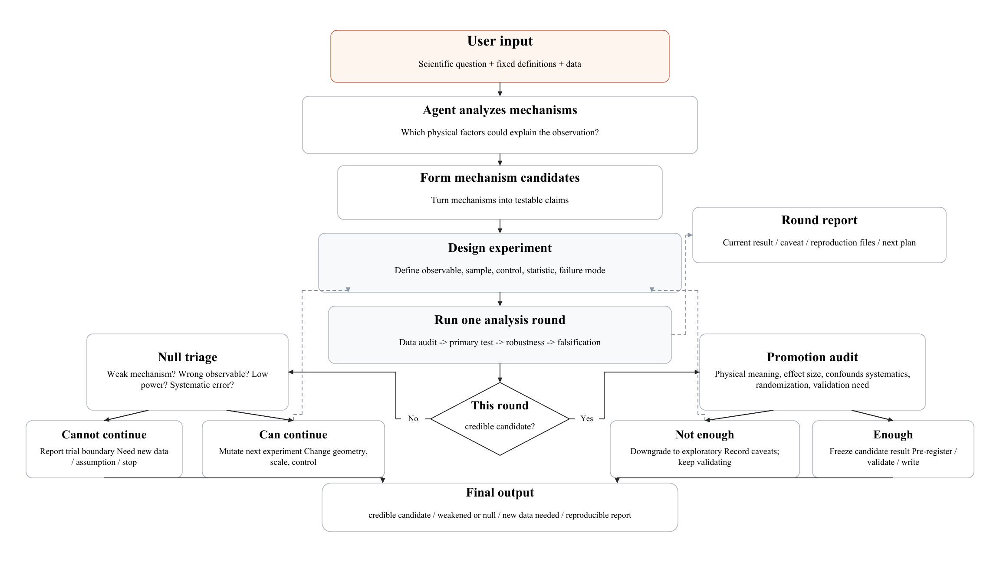

# Scientific Autoresearch



`scientific-autoresearch` is a skill for autonomous scientific research agents. It helps an agent move from a scientific question to mechanism-first hypotheses, testable claims, falsification checks, conservative interpretation, and reproducible round-by-round reports.

The project was inspired by Andrej Karpathy's
[`autoresearch`](https://github.com/karpathy/autoresearch) project and adapts
agent-run iterative research to mechanism-first scientific searches.

## What This Skill Is For

Use this skill when the task is open-ended research rather than a known pipeline:

- generate and maintain a portfolio of candidate mechanisms,
- translate mechanisms into observables and tests,
- distinguish support, missingness, nondetection, and true zero,
- respond to null results without prematurely killing a broad mechanism,
- redesign observables when raw measurements fail structurally,
- track systematic uncertainties and physical effect sizes,
- decide when to continue, freeze, demote, reject, request data, or write up.

## Key Ideas

The core loop is:

```text
question -> mechanism -> testable claim -> data/model -> falsification -> interpretation -> next question
```

The skill emphasizes:

- **Mechanism-first research**: test why something should happen, not only which column correlates.
- **Observable geometry**: match the observable to the mechanism, including proximity, cumulative contribution, natural scale, support, and background contrast.
- **Failure-mode driven redesign**: when a raw observable fails structurally, ask whether it should be background-relative, normalized, signed, residualized, or matched-control corrected.
- **Multi-factor mechanisms**: combine variables only when the mechanism justifies the composite.
- **Null triage**: a failed formulation is not automatically a failed mechanism.
- **Round gates**: every round must end with a checklist that prevents premature stopping.
- **Conservative promotion**: effect size, systematics, search history, and reproducibility matter as much as p-values.

## Inputs, Workflow, and Outputs

This repository provides a promptable research protocol for LLM-based research assistants that can read Markdown instructions and work with local files.

### Inputs

A run should start with:

- a scientific question or candidate mechanism,
- available data files, models, notebooks, scripts, papers, or simulations,
- scope constraints such as allowed data, allowed tools, round budget, and stopping rules,
- known quality limits, selection effects, masks, or missing-data concerns,
- a requested output directory or naming convention when reproducibility artifacts should be saved.

### Workflow

The workflow diagram is included below.


### Outputs

A well-run trial should produce:

- `report.md` or `round_XX_report.md`: question, mechanism, method, result, interpretation, caveats, and next decision,
- `inventory.json`: inputs, versions, hashes when practical, parameters, random seeds, sample counts, and output paths,
- `summary.csv`: tested claims, features, models, metrics, status labels, and caveats,
- `diagnostics.csv` or per-round diagnostics: per-object or per-case data needed to rebuild plots and statistics,
- `figures/`: diagnostic or result plots,
- `reproduce_commands.txt`: exact commands and environment notes,
- `candidate_registry.csv` or `.json`: candidate mechanisms and formulations with status and caveats,
- `candidate_board.csv` or `.md`: ranked or grouped current candidates, including diagnostics and confounder checks.

The `round-gate-checklist.md` reference is mandatory for autoresearch runs. It is designed to prevent premature null conclusions and unexamined promotion.

## Repository Layout

```text
.
|-- README.md
|-- CITATION.cff
|-- CITATION.bib
|-- LICENSE
|-- .gitignore
|-- docs/
|   `-- scientific_autoresearch_flow.png
`-- scientific-autoresearch/
    |-- SKILL.md
    `-- references/
        |-- claim-types.md
        |-- falsification-toolkit.md
        |-- null-triage.md
        |-- report-contract.md
        |-- round-gate-checklist.md
        |-- scientific-review-lens.md
        `-- thinking-principles.md
```

Only the `scientific-autoresearch/` folder is the installable skill. The repository-level `README.md`, `LICENSE`, and `.gitignore` are for open-source distribution.

## Installation

Place the `scientific-autoresearch/` directory wherever an LLM system loads
reusable Markdown instructions or skills. For a Unix-like local skills
directory, one minimal example is:

```bash
mkdir -p ~/.local/share/llm-skills
cp -R scientific-autoresearch ~/.local/share/llm-skills/
```

## Basic Usage

Ask the LLM research assistant to use the skill for an open-ended scientific trial:

```text
Use the scientific-autoresearch skill.

Goal:
Investigate whether the available data contain a physically interpretable signal related to [scientific question].

Use only the files in the current working directory.
Start with Round 0: inventory, data-quality audit, candidate portfolio, and proposed first round.
Then proceed autonomously until a natural decision boundary.
After each round, report the current result, main caveat, and next planned round.
```

## Example Use Cases

The skill is most useful when a project needs to:

- compare multiple candidate mechanisms before choosing a primary test,
- turn qualitative explanations into observables and falsification checks,
- audit whether a dataset can support a proposed claim,
- redesign an observable when a raw measurement fails structurally,
- keep exploratory scans separate from confirmatory interpretation,
- produce round-by-round reports with inputs, tested claims, caveats, and next decisions.

## Interpretation Standard

Promote a result only when it has:

- a clear mechanism,
- a mechanism-matched observable,
- a supported sample definition,
- a meaningful effect size,
- an uncertainty and systematic-error budget,
- falsification or robustness checks that could have hurt it,
- transparent search history,
- reproducible diagnostics.

Exploratory results are valuable, but they should be labeled as exploratory.

## Inspiration

This skill was inspired by Andrej Karpathy's
[`autoresearch`](https://github.com/karpathy/autoresearch) project, which
demonstrated an autonomous agent loop for bounded research experiments over a
small LLM training setup. `scientific-autoresearch` adapts the broader idea of
agent-run iterative research to mechanism-first scientific searches, with
emphasis on support audits, falsification checks, uncertainty tracking, and
conservative interpretation.

## Citation

If you use this skill, please cite the release metadata in
[`CITATION.cff`](CITATION.cff). A BibTeX entry for LaTeX and Zotero import is
also provided in [`CITATION.bib`](CITATION.bib). For manuscripts, cite the tagged
GitHub release.

## License

MIT License. See `LICENSE`.
