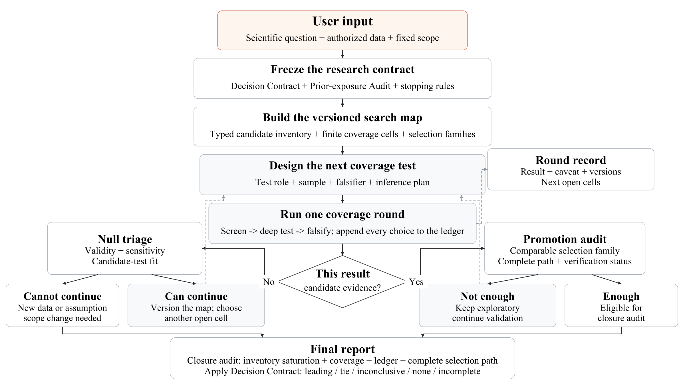

# Scientific Autoresearch

`scientific-autoresearch` is a client-neutral [Agent Skill](https://agentskills.io) for designing, executing, auditing, and teaching scientific investigations. It connects scientific questions to testable predictions, supported analyses, and decisions about what to investigate next.

Current version: **0.4.0**.

The same workflow serves models and Agent clients that support the Agent Skills format. Its instructions follow the scientific task, available evidence, and requested scope.



[Vector PDF](figures/scientific-autoresearch-workflow.pdf) · [Vector SVG](figures/scientific-autoresearch-workflow.svg)

The figure shows systematic coverage of a finite, data-supported candidate space. Prespecified analyses and adaptive investigations share its test–interpret–decide loop; coverage maps and closure reviews apply when systematic coverage is requested.

## Version 0.4.0 Highlights

- Research design, execution, audit, and reasoning instruction are available through one skill. Teaching includes framing questions, choosing falsifiers, interpreting weak results, and distinguishing data, model, and question limitations.
- Prespecified procedures can use data to determine their next steps while retaining their declared inferential status, provided the procedure and its selection effects are handled by a valid design. Scientific changes chosen outside that procedure after viewing outcomes are recorded as outcome-informed successors.
- Evidence requirements follow the scientific claim and the complete selection process. Appropriate holdout, sequential, selective, or other justified methods can support inference; independent verification is reported as a distinct evidence stage.
- Completion states are defined in the core instructions. Detailed scientific stopping review is used before concluding that no material test remains or ending an investigation on a scientific basis.

## How It Works

1. **Define the scientific decision.** Specify the question, target population, quantity to estimate, meaningful effect scale, available data, and independent statistical unit.
2. **Develop testable candidates.** Connect each mechanism, model, relation, or design to its predictions, data support, and potential falsifiers.
3. **Prespecify the next test.** Freeze the next informative test or coherent batch, including comparisons, uncertainty, decision rules, and reporting. A fully specified program can freeze its complete procedure at once.
4. **Interpret the evidence.** Assess effect sizes, uncertainty, sensitivity, systematics, and the selection process. Weak or conflicting results guide the next supported test or identify the need for better data.
5. **Report the result and next step.** Preserve favorable and unfavorable attempts, explain outcome-informed changes, and distinguish completion of the requested work from scientific stopping and finite-scope coverage.

Use one compact candidate board and result–decision record for ordinary investigations. Detailed references are loaded when the task needs them, such as dependent observations, causal inference, machine learning, selection correction, or scientific stopping.

An explicitly iterative request authorizes continued investigation within its stated scope and resources. A design request produces a plan; a named test produces that test and its interpretation; an audit reviews the available evidence. Teaching requests explain the reasoning with examples or exercises. Prospective, sensitive, costly, or regulated work uses the applicable project protocol and authorization requirements.

## Example Requests

### Research design

```text
Use scientific-autoresearch to turn this question and dataset into a research plan.
Identify the leading candidates, their distinct predictions, and the first
informative test. Explain the data support and uncertainty needed for a decision.
```

### Prespecified analysis

```text
Use scientific-autoresearch to execute this prespecified analysis program.
Check the data support, comparison and stopping rules, run the analysis, and report
effect sizes, uncertainty, and the conclusion supported by the design.
```

### Iterative investigation

```text
Use scientific-autoresearch to investigate these candidates iteratively within
this dataset and compute budget. Keep a compact record, learn from each result,
and continue while a supported test could materially change the conclusion.
```

### Scientific audit

```text
Use scientific-autoresearch to review this analysis and its results.
Assess whether the claim matches the estimand, data support, uncertainty,
selection process, and available verification. Identify material open tests.
```

### Research-reasoning lesson

```text
Use scientific-autoresearch to teach me how to distinguish a weak hypothesis
from an insensitive test. Work through an example and help me choose a useful
next observation or analysis.
```

For systematic coverage, request a finite data-supported candidate and test space explicitly. The skill then maintains a versioned inventory, coverage record, and exact queue of remaining tests. Completion refers to that declared scope.

## Installation

Download [scientific-autoresearch-v0.4.0-skill.zip](https://github.com/JialeWW/scientific-autoresearch/releases/download/v0.4.0/scientific-autoresearch-v0.4.0-skill.zip) from the [v0.4.0 release](https://github.com/JialeWW/scientific-autoresearch/releases/tag/v0.4.0). Extract its `scientific-autoresearch/` directory into the skills directory recognized by your Agent client. The installed path must contain `scientific-autoresearch/SKILL.md`.

The archive includes the core instructions, scientific references, and license. All research and teaching functions are included in this single skill.

For installation from source:

```bash
git clone --branch v0.4.0 --depth 1 https://github.com/JialeWW/scientific-autoresearch.git
mkdir -p /path/to/your/skills-directory/scientific-autoresearch
cp scientific-autoresearch/scientific-autoresearch/SKILL.md /path/to/your/skills-directory/scientific-autoresearch/
cp -R scientific-autoresearch/scientific-autoresearch/references /path/to/your/skills-directory/scientific-autoresearch/
cp scientific-autoresearch/LICENSE /path/to/your/skills-directory/scientific-autoresearch/
```

## Scientific Interpretation

Direct candidate comparisons require compatible targets, support, estimands, evidence, and data quality. Inference accounts for the full procedure used to generate, modify, compare, and select candidates. Prespecified data-dependent procedures and outcome-informed changes are recorded according to their actual design and evidence exposure.

A null conclusion requires enough support and sensitivity to address the meaningful effect under study. Otherwise, the result is reported as inconclusive or support-limited, with the data or test needed to resolve it. Reproduction, internal validation, selection-adjusted inference, and independent verification are reported at their respective evidence stages.

## Evaluation Status

Repository checks cover package structure, reference consistency, release metadata, reproducible installation archives, and selected instruction regressions. Behavioral and empirical-method evaluation for v0.4.0 remain **`not_evaluated`**. Cross-model performance has not been measured.

[Benchmark documentation](benchmarks/README.md) describes the evaluation protocols, development cases, and qualitative probes. The frozen protocol **2.1.2** remains bound to skill **0.2.8** and its historical inputs and results. Development specifications and probes provide diagnostic material for future evaluation.

## Repository Resources

- [`scientific-autoresearch/SKILL.md`](scientific-autoresearch/SKILL.md): core workflow and reference routing.
- [`scientific-autoresearch/references/`](scientific-autoresearch/references/): guidance for scientific reasoning, inference, data domains, execution, and stopping.
- [`scripts/`](scripts/): package validation and release-archive tools.
- [`benchmarks/`](benchmarks/): evaluation protocols, development cases, and results.
- [`compatibility/README.md`](compatibility/README.md): guidance for existing schema-1.5.4 machine-audit runs, preserved in the [v0.3.0 release](https://github.com/JialeWW/scientific-autoresearch/tree/v0.3.0).
- [`CHANGELOG.md`](CHANGELOG.md): release history.

## Inspiration

This project was inspired by Andrej Karpathy's [`autoresearch`](https://github.com/karpathy/autoresearch) and adapts iterative Agent-run experimentation to general scientific inference with falsification, adaptive-selection control, and reproducibility.

## Citation and License

Use [`CITATION.cff`](CITATION.cff) or [`CITATION.bib`](CITATION.bib) to cite a tagged release. Distributed under the [MIT License](LICENSE).
